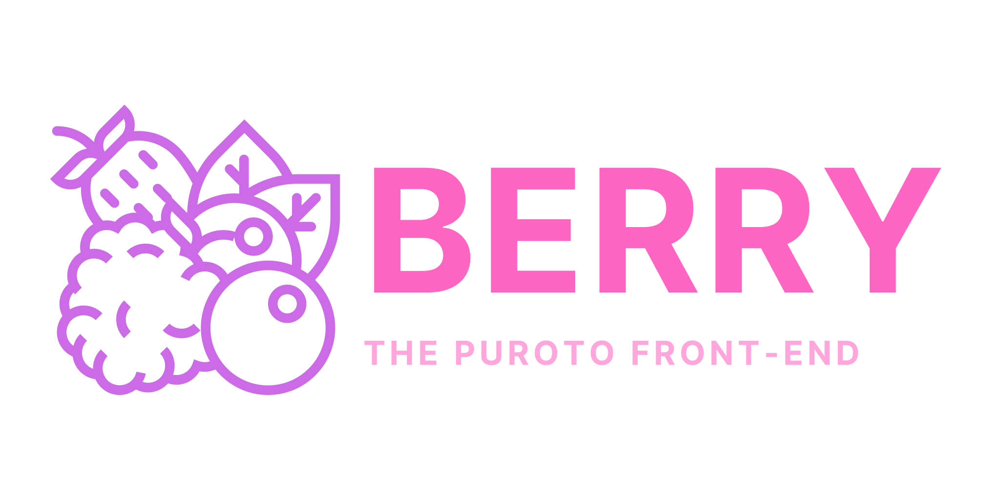

<p align="center">
  
</p>

[](https://github.com/PurotoApp/Berry/actions/workflows/codeql-analysis.yml)
[](https://github.com/PurotoApp/Berry/actions/workflows/linting.yml)

[](https://discord.puroto.net/)
[](https://twitter.com/PurotoApp)

Berry is a progressive web application that allows you to interact with [cascade](https://github.com/PurotoApp/cascade), the PurotoApp API. This is the front-end of [Puroto](https://puroto.net).

## Contributing

We highly appreciate all kinds of contributions to Berry. For learning more about contributing to berry in an open source matter, please see our [contribution guidelines](https://github.com/PurotoApp/Berry/blob/master/.github/CONTRIBUTING.md) for more informations.

## Building berry locally

### Prerequisites

- Latest version of [Node.js](https://nodejs.org/)
- Latest version of [git](https://git-scm.com/)
- Latest version of [npm](https://www.npmjs.com/)

### Compiling

1. Open a terminal and clone this repository using git.
   ```
   git clone https://github.com/PurotoApp/Berry.git
   ```
2. cd into the repository folder and install the dependencies.
   ```
   cd Berry
   npm install
   ```
3. Run the application.
   ```
   npm run dev
   ```

---

###### Made and maintained with ❤ by PurotoApp and its community.

###### Copyright (c) 2022 PurotoApp under the GPLv3 license.
